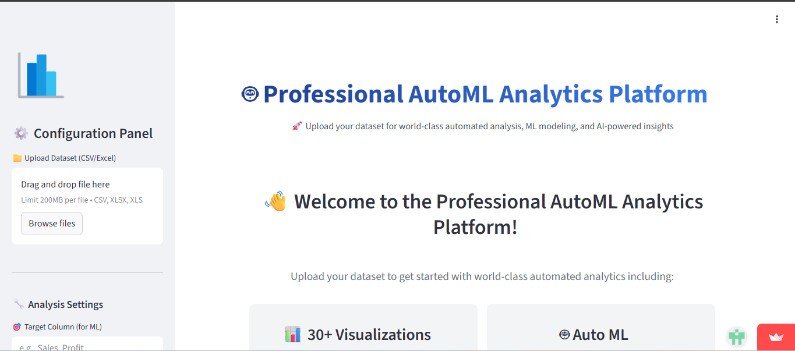
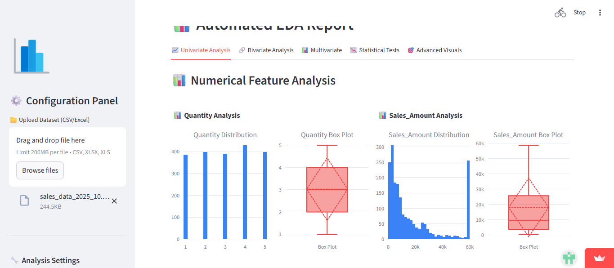
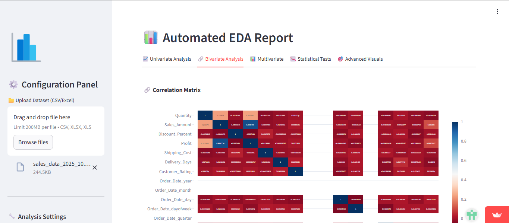

# 📊 Monthly Sales Analytics Platform

<div align="center">


**[Live Demo](https://monthly-sales-analysis.streamlit.app/) • [Report Bug](https://github.com/shubham001official/Monthly-Sales-Analytics-Platform/issues) • [Request Feature](https://github.com/shubham001official/Monthly-Sales-Analytics-Platform/issues)**

</div>

## 🎯 Overview

A **production-ready automated analytics platform** that transforms raw sales data into actionable insights. This enterprise-grade tool combines automated EDA, machine learning, and AI-powered analytics into a single intuitive interface.

### ✨ Key Features

| Feature | Description |
|---------|-------------|
| **🤖 Auto ML Pipeline** | Automated model selection, training, and comparison |
| **📊 30+ Visualizations** | Comprehensive EDA with interactive Plotly charts |
| **🎯 KPI Dashboard** | Real-time metrics with professional card design |
| **🚨 Anomaly Detection** | Automated outlier detection and visualization |
| **💡 AI Insights** | Pattern recognition and business recommendations |
| **📑 PDF Reports** | Professional documentation with one-click export |
| **🔧 Smart Preprocessing** | Intelligent missing value handling & feature engineering |
| **📈 Data Quality Scoring** | Real-time data quality assessment |

## 🚀 Live Demo

Experience the platform live: **[https://monthly-sales-analysis.streamlit.app/](https://monthly-sales-analysis.streamlit.app/)**

## 📋 Table of Contents

- [Features](#-features-in-detail)
- [Tech Stack](#-tech-stack)
- [Installation](#-installation)
- [Quick Start](#-quick-start)
- [Usage Guide](#-usage-guide)
- [Dataset Requirements](#-dataset-requirements)
- [Screenshots](#-screenshots)
- [Contributing](#-contributing)
- [License](#-license)
- [Contact](#-contact)

## 🎨 Features in Detail

### 1. **Intelligent Data Preprocessing**
- ✅ Automatic missing value imputation (mean/median/mode based on skewness)
- ✅ Outlier detection and capping (IQR method)
- ✅ Duplicate removal
- ✅ Feature engineering from dates
- ✅ Categorical encoding (one-hot/label encoding)

### 2. **Comprehensive EDA (30+ Visualizations)**

#### Univariate Analysis
- Distribution histograms with KDE
- Box plots with statistics
- Violin plots
- Q-Q plots
- Frequency bar charts

#### Bivariate Analysis
- Correlation heatmaps
- Scatter plots with trendlines
- Pair plots
- Cross-tabulations
- Grouped comparisons

#### Multivariate Analysis
- 3D scatter plots
- Parallel coordinates
- Radar charts
- Sunburst hierarchies
- Contour plots

### 3. **Automated Machine Learning**
- **Regression**: Linear Regression, Random Forest, Gradient Boosting
- **Classification**: Logistic Regression, Random Forest, XGBoost
- **Model Comparison**: RMSE, R², Accuracy scores
- **Feature Importance**: Automatic importance ranking
- **Cross-validation**: Built-in validation

### 4. **Anomaly Detection**
- Z-score based detection
- IQR outlier identification
- Visual anomaly highlighting
- Automated reporting

### 5. **Professional Reporting**
- One-click PDF report generation
- Statistical summaries
- ML model performance
- Data quality metrics
- Correlation insights

## 🛠️ Tech Stack

```
├── Frontend
│   ├── Streamlit (Web Framework)
│   ├── Plotly (Interactive Visualizations)
│   └── Custom CSS (Professional Styling)
│
├── Backend
│   ├── Python 3.13.12
│   ├── Pandas (Data Processing)
│   ├── NumPy (Numerical Computing)
│   └── Scikit-learn (Machine Learning)
│
├── Visualization
│   ├── Plotly Express
│   ├── Plotly Graph Objects
│   ├── Matplotlib
│   └── Seaborn
│
└── ML & Statistics
    ├── Scikit-learn
    ├── SciPy
    └── Statsmodels
```

## 📦 Installation

### Prerequisites
- Python 3.13.12 or higher
- pip package manager
- Git (optional)

### Step-by-Step Installation

1. **Clone the repository**
```bash
git clone https://github.com/shubham001official/Monthly-Sales-Analytics-Platform.git
cd monthly-sales-analytics
```

2. **Create virtual environment** (recommended)
```bash
# Windows
python -m venv venv
venv\Scripts\activate

# Linux/Mac
python3 -m venv venv
source venv/bin/activate
```

3. **Install dependencies**
```bash
pip install -r requirements.txt
```

Or install individually:
```bash
pip install streamlit pandas numpy plotly scikit-learn scipy matplotlib seaborn openpyxl xlsxwriter
```

4. **Run the application**
```bash
streamlit run app.py
```

5. **Open in browser**
```
http://localhost:8501
```

## 🚀 Quick Start

```python
# 1. Import required libraries
import streamlit as st
import pandas as pd

# 2. Load your data
df = pd.read_csv('your_sales_data.csv')

# 3. Run the app
# Just execute: streamlit run app.py

# 4. Upload your CSV/Excel file through the UI
# 5. Configure analysis settings in sidebar
# 6. Click "Generate Analysis"
```

## 📖 Usage Guide

### 1. **Data Upload**
- Support CSV and Excel formats
- Automatic data quality assessment
- Preview first 10 rows

### 2. **Configuration**
- Select target column for ML
- Choose analysis modules
- Set visualization theme
- Enable/disable AI insights

### 3. **Analysis Modules**
- **Basic EDA**: Summary statistics, distributions
- **Advanced Visualization**: 3D plots, parallel coordinates
- **Statistical Tests**: Normality tests, ANOVA
- **Time Series**: Trend analysis, seasonality
- **Machine Learning**: Automated model building
- **Anomaly Detection**: Outlier identification

### 4. **Export Options**
- Download processed data (CSV/Excel/JSON)
- Generate PDF reports
- Export visualizations

## 📊 Dataset Requirements

### Recommended Structure
Your dataset should contain:

| Column Type | Examples | Requirements |
|------------|----------|--------------|
| **Date** | Order_Date, Date | For time series analysis |
| **Numeric** | Sales_Amount, Profit, Quantity | For statistical analysis |
| **Categorical** | Region, Product_Category | For grouping & segmentation |
| **Target** | Sales, Profit, Rating | For ML modeling |

### Sample Data Format
```csv
Order_ID,Order_Date,Region,Product_Category,Sales_Amount,Profit,Quantity
1001,2024-01-15,North,Electronics,1500.00,300.00,5
1002,2024-01-16,South,Clothing,800.00,150.00,3
```

## 📸 Screenshots

<div align="center">
  
### 📊 Dashboard Overview


### 🔍 EDA Visualizations


### 🤖 ML Results


</div>

## 🤝 Contributing

Contributions are welcome! Please follow these steps:

1. Fork the repository
2. Create your feature branch (`git checkout -b feature/AmazingFeature`)
3. Commit your changes (`git commit -m 'Add some AmazingFeature'`)
4. Push to the branch (`git push origin feature/AmazingFeature`)
5. Open a Pull Request

### Contribution Guidelines
- Follow PEP 8 style guide
- Add comments for complex logic
- Update documentation
- Test with sample data

## 📄 License

This project is licensed under the MIT License - see the [LICENSE](LICENSE) file for details.

## 📧 Contact

**Shubham Sharma**

Project Link: [https://github.com/shubham001official/Monthly-Sales-Analytics-Platform](https://github.com/shubham001official/Monthly-Sales-Analytics-Platform)

Live Demo: [https://monthly-sales-analysis.streamlit.app/](https://monthly-sales-analysis.streamlit.app/)

## 🙏 Acknowledgments

- [Streamlit](https://streamlit.io/) for the amazing framework
- [Plotly](https://plotly.com/) for interactive visualizations
- [Scikit-learn](https://scikit-learn.org/) for ML capabilities
- All contributors and users

---

<div align="center">
  
### ⭐ Star this repository if you find it useful!

[](https://github.com/shubham001official/Monthly-Sales-Analytics-Platform-Platform/stargazers)

</div>
